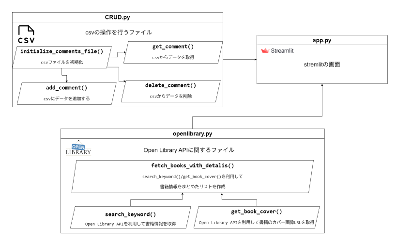

# 書籍情報を取得＆コメントを記録するアプリ

このアプリは、ユーザーが入力した書名または、著者名などをもとに [Open Library API](https://openlibrary.org/developers/api) から書籍情報を取得し、タイトル・著者・出版年・表紙画像などを表示します。また、書籍に対してコメントを入力し、CSVファイルに保存・表示・削除することができます。

## アプリ概要

### 主な機能

- 書名や著者名などのキーワードから書籍情報を検索
- 書籍のタイトル・著者・出版年・表紙画像を表示
- 10件ずつのページネーション表示に対応
- コメントを入力してCSVファイルに保存

### 使用技術・サービス

| 項目 | 内容 |
|------|------|
| フレームワーク | [Streamlit](https://streamlit.io/) |
| 外部API | [Open Library API](https://openlibrary.org/developers/api)（APIキー不要） |
| 言語 | Python |
| データ保存形式 | CSV |

## 使用しているAPI

- **Open Library API**
  - 書籍情報取得（`https://openlibrary.org/search.json`）
  - カバー画像取得（`https://covers.openlibrary.org/b/id/{cover_id}-{size}.jpg`）

## システム構成図 / コード説明図

以下にシステム構成とコードの構成を図で示します。

### システム構成図

- ユーザー入力（ISBNまたは書名）
- → Open Library APIへリクエスト
- → 書籍情報取得 → Streamlitで表示
- → コメント入力 → CSVに保存

### コード構成図

- `app.py`：Streamlitアプリ本体（UI）
- `utils`
    - `CRUD.py`: CSV操作処理
    - `openlibrary.py`: APIリクエスト処理

